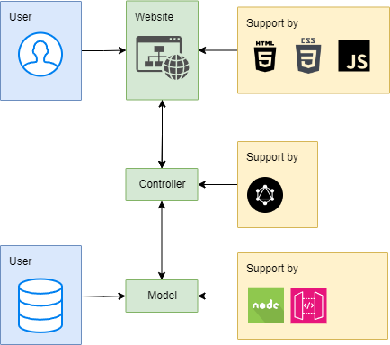

# Implementacion-SeguroVehiculo
_Goal: Create an insurance simulator that must consider certain conditions depending on the information entered in a form._

_Completed by: Pilar Camargo Márquez_
<br />
[Website](https://about.me/justoneye) | [GitHub](https://github.com/justoneye) | [LinkedIn](https://www.linkedin.com/in/pilarcamargo)
<br /><br />

## Tech Stack

- HTML 5
- CSS 3
- JavaScript

<br />


## File Structure

```
Implementacion-SeguroVehiculo/
├── multimedia/
|   └── images, logo, favicon...
└── index.html
└── styles.css
└── README.md
  
```
<br />


## Evaluation Items

- Validation in all fields of the form.
- Communication between parent and child.
- Show one, two, three or no cards depending on the data entered in the form, complying with the proposed rules.
- Mathematical operations.
- Styles of the site.
- The site must be responsive, it is necessary to be able to view it without problem on all devices.
- Code organization.
- HTML5 (Html, CSS, Javascript) should be used for development.

<br />


## Deliverables

- [x] File containing HTML, CSS and JavaScript.
- [x] Additional questions.

<br />

## EXTRA QUESTIONS
#### 1. Suggest a backend architecture you would use for the theme.
_R/:_
<div align="center">
    
</div>
<br /><br />

#### 2. Evaluate if what you propose is the most efficient, or if it seems to you that there are ways easier to deploy.
_R/: Any algorithm is susceptible to being changed and optimized, in this case, it would have proposed to create the insurance card information in a JSON file along with the characteristics, variables and percentages to make the calculations for each offer. In addition to creating a better user interface, using a framework to manage states and calculate offers in parallel with filling out the form._
<br /><br />

#### 3. What AI tools would you use to improve code performance?
_R/: Along with GitHub Copilot and ChatGPT, add tools that suggest code optimizations, bug fixes, code minification, and optimization with multimedia content._
<br /><br />


### GitHub Repository

https://github.com/justoneye/Implementacion-SeguroVehiculo
